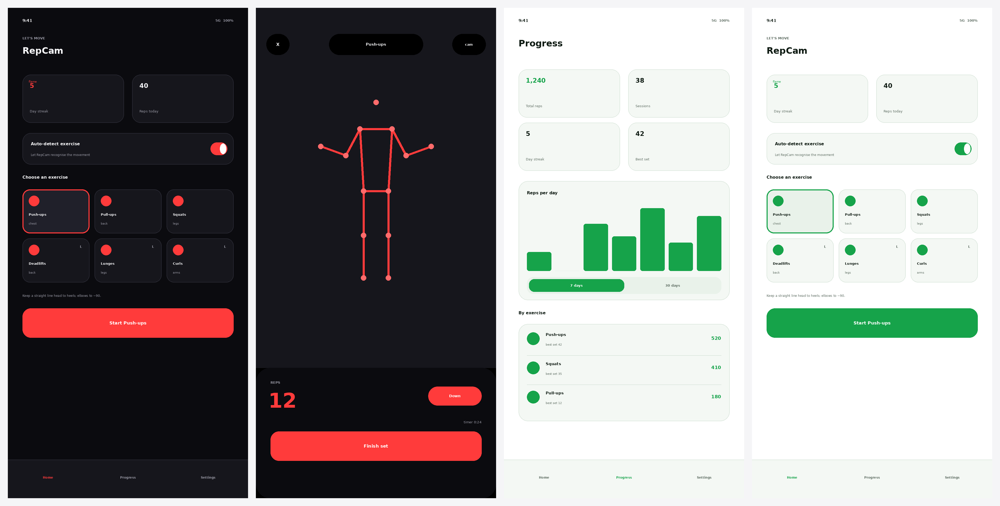

# RepCam — Explainer

> **TL;DR** RepCam counts your exercise reps from the phone camera, entirely
> on-device. The interesting engineering isn't the camera — it's turning a noisy
> stream of body keypoints into a rep count you can trust. We do that with a tiny
> pure-TypeScript core that we can test exhaustively, wrapped in a thin Expo/React
> Native app with two themes and local-only storage.



*From left: Home (dark/red), a live session with the pose overlay and rep counter,
Progress (light/green), and Home (light/green). Previews are rendered from the
app's real theme tokens.*

---

## Background

### For the newcomer: how does a phone "see" a rep?

A modern phone can't literally see a "push-up". What it *can* do is run a small
neural network called a **pose estimator** on each camera frame. The model we use,
**MoveNet**, takes an image and returns **17 keypoints** — nose, shoulders, elbows,
wrists, hips, knees, ankles, and so on — each with an `(x, y)` position and a
confidence `score` between 0 and 1.

> 🧠 **Definition — keypoint.** A single tracked body landmark, e.g. `left_elbow`,
> reported as a pixel position plus a confidence. A *pose* is the set of all 17
> for one person in one frame.

So thirty times a second we get a fresh skeleton. The catch: those numbers are
**noisy**. A wrist might jump a few pixels between frames, a knee might briefly
drop to `score: 0.1` when your leg crosses in front of it, and the model
occasionally hallucinates. If we naïvely counted "arm bent = rep", a single noisy
frame would inflate your count.

### The narrow problem this change solves

This repository starts empty. The change introduces the **whole app**, but its
beating heart is the **rep-counting engine**: a deterministic function from a
stream of poses to a rep count that is robust to jitter, occlusion, and
half-reps. Everything else — camera plumbing, theming, storage, charts, the
paywall — is scaffolding around that core.

A deliberate architectural choice runs through the codebase:

> 📐 **Principle.** Keep the *logic* (rep counting, classification, stats) as pure
> TypeScript with no React Native or TensorFlow imports. Keep the *I/O* (camera,
> model, storage, purchases) behind small interfaces. The logic is then trivially
> unit-testable, and the I/O can be swapped for test/demo doubles.

---

## Intuition

### A rep is a full round-trip of one angle

Almost every rep is one joint swinging down and back up. A push-up is your
**elbow** angle going from ~170° (arms straight) down to ~90° (chest low) and back.
A squat is your **knee** angle doing the same. So for each exercise we compute a
single scalar **signal** — usually a joint angle — and watch it oscillate.

We adopt one convention that unifies all nine exercises:

> **Rest is HIGH, effort is LOW.** At the top/rest of a rep the signal is large;
> at the bottom/effort peak it is small. A rep is one full *dip and return*.

For a couple of exercises the natural angle runs the other way (a shoulder press
is *extended* overhead at the top), so their signal is simply `180 − angle`. Now a
single state machine counts them all.

### Hysteresis: the trick that kills jitter

Imagine a single threshold at 130°. If your elbow hovers right around 130° while
you pause at the top, tiny jitter (129.8°, 130.2°, 129.9°, …) would flip the state
back and forth and spray phantom reps. The fix is two thresholds with a gap between
them — a **dead-band**:

```
        signal (elbow angle)
 175° ┐        ╭─────╮                    ╭─────╮
      │  up    │     │  up                │      up
 150° ┤────────┤     ├────────────────────┤────────  highThreshold
      │  DEAD  │     │  DEAD-BAND (hold)  │
 100° ┤────────┤     ├────────────────────┤────────  lowThreshold
      │ down   ╰─────╯ down               ╰─────
  90° ┘   (one full down→up = 1 rep)
```

While the signal sits inside the band, the state is **held**. You only commit to
`down` below 100° and back to `up` above 150°. Jitter in between changes nothing.

> ⚠️ **Edge case — the cold start.** If pose detection happens to begin while you're
> already at the bottom of a movement, coming up once shouldn't count as a full rep.
> The counter refuses to count a rep until it has seen a clean top at least once.

### Auto-detection: read a few obvious cues

When you don't pick an exercise, we guess from a ~1-second window of poses. Rather
than a second neural net, we read interpretable cues: Is the torso horizontal
(push-up family) or vertical (standing lifts)? Are the wrists overhead (pull-up /
press)? Which joint has the biggest range of motion (elbows → pressing, knees →
squats, hips → hinge)? We score each candidate and pick the clear leader.

---

## Code

### 1. Geometry and smoothing (`src/core/pose`)

`angles.ts` is pure trigonometry. The workhorse is the interior angle at a joint:

```ts
export function angleAt(a: Point, b: Point, c: Point): number {
  const abx = a.x - b.x, aby = a.y - b.y;
  const cbx = c.x - b.x, cby = c.y - b.y;
  const dot = abx * cbx + aby * cby;
  const cos = Math.max(-1, Math.min(1, dot / (Math.hypot(abx, aby) * Math.hypot(cbx, cby))));
  return (Math.acos(cos) * 180) / Math.PI;   // straight arm ≈ 180°, bent ≈ 90°
}
```

`bestSideJointAngle` picks whichever of your left/right sides the camera sees most
confidently, so filming from an angle still works. `smoothing.ts` is a one-line
exponential moving average that takes the edge off frame-to-frame noise.

### 2. The exercise catalogue (`src/core/reps/exercises.ts`)

Each exercise is data plus a `signal` function. Note the two inverted ones:

```ts
shoulder_press: {
  // rack (rest) ≈ elbow 90° → signal 90 (high); overhead ≈ 170° → signal 10 (low)
  lowThreshold: 40, highThreshold: 75,
  signal: (pose) => { const a = elbowAngle(pose); return a === undefined ? undefined : 180 - a; },
  ...
},
```

### 3. The state machine (`src/core/reps/RepCounter.ts`)

This is the whole counting rule, hysteresis and cold-start guard included:

```ts
if (signal >= this.exercise.highThreshold) {
  if (this.state === 'down' && this.hasBeenUp) { this.repCount += 1; repCompleted = true; }
  this.state = 'up';
  this.hasBeenUp = true;
} else if (signal <= this.exercise.lowThreshold) {
  this.state = 'down';
}
// inside the dead-band → hold current state
```

Low-confidence frames (signal `undefined`) are ignored entirely, so a brief
occlusion never corrupts the count.

### 4. Auto-detection (`src/core/reps/autoDetect.ts`)

Tracks the min/max of each joint angle across the window, measures torso
inclination and an "overhead" ratio, then scores each candidate exercise and
returns the leader if it's clearly ahead.

### 5. Stats (`src/data/aggregate.ts`, `src/core/stats/charts.ts`)

Pure reducers over the stored sessions: `totalReps`, `repsByExercise`,
`personalBests`, `repsPerDay` (a continuous series including zero days),
`currentStreak`, and a `summarize` roll-up. `buildBarChart` turns a series into
bar rectangles the SVG chart just renders.

### 6. The device edges (`src/services`, `src/data`, `src/context`)

- `PoseProvider` interface with `MoveNetPoseProvider` (real, on-device) and
  `MockPoseProvider` (synthetic mover for demo/tests).
- `EntitlementService` with `LocalEntitlementService` (ships enabled); swap for
  `react-native-iap` to go live.
- `HistoryRepository` / `PreferencesRepository` over AsyncStorage, each with an
  in-memory twin.
- React contexts (`Settings → Theme → Entitlement → History`) expose it all to the
  screens.

### 7. UI (`src/components`, `src/screens`, `src/theme`)

Two themes are two `ThemeColors` objects; every component reads colors via
`useTheme()`, so switching recolors the whole app. Screens: **Home** (pick exercise
/ auto-detect / start), **Session** (camera + live overlay + big rep counter),
**Progress** (stats + bar chart), **Settings** (theme, haptics, purchase, clear
data), and a **Paywall**.

### 8. Bundler note (`metro.config.js`)

`@tensorflow-models/pose-detection` barrel-imports web-only backends (WebGPU,
MediaPipe) we never use on-device. A small Metro resolver maps those to an empty
stub so the native bundle stays lean.

---

## Verification

### Automated

- **51 unit tests** over the pure core (`npm test`): angle math, EMA, the
  `RepCounter` (full reps, half-reps rejected, jitter rejected, cold-start guard,
  occlusion handling, rep-completed flags), exercise signals, auto-detection for
  squats vs push-ups, all the stats reducers, and chart geometry.
- **Type safety:** `npm run typecheck` passes for the entire app.
- **Bundles cleanly:** `npx expo export --platform ios` produces a bundle with no
  unresolved modules — i.e. every import across the app graph resolves.

```
Test Suites: 7 passed, 7 total
Tests:       51 passed, 51 total
```

### Manual QA on a device

1. `npm install && npm start`; open on a phone (Expo Go or a dev build).
2. On **Home**, pick *Push-ups* and tap **Start**. Grant camera permission.
3. Prop the phone so your upper body is in frame; do 5 slow push-ups. The overlay
   skeleton should track you and the counter should read **5**, ticking on each
   *return to the top*. Try a deliberate half-rep — it should **not** count.
4. Tap **Finish set**. On **Progress**, confirm the reps, streak and the *Reps per
   day* chart updated.
5. In **Settings**, switch **Light/Dark** and confirm the whole app recolors
   (white/green vs black/red). Toggle **Haptics** and feel the buzz per rep.
6. No device? In the session screen tap the 🎬 toggle for **Demo mode** to watch
   the full pipeline count a synthetic mover.

---

## Alternatives

**1. Pose model: MoveNet (chosen) vs a heavier BlazePose / MediaPipe pipeline**

| Pros of MoveNet (chosen) | Cons of MoveNet (chosen) |
| --- | --- |
| Small + fast; smooth real-time on mobile | Only 17 keypoints (no hands/face detail) |
| First-class support in `tfjs-react-native` | Single-person only |
| No extra native SDK to integrate | Slightly less accurate on deep occlusion |

**2. Rep counting: hysteresis state machine (chosen) vs a learned/DTW classifier**

| Pros of the state machine (chosen) | Cons of the state machine (chosen) |
| --- | --- |
| Interpretable, debuggable, unit-testable | Per-exercise thresholds are hand-tuned |
| Zero training data or ML infra needed | Struggles with very unusual form/tempo |
| Deterministic → trivial to test | Won't generalise to brand-new movements for free |

---

## Suggested people to talk to

This is a **greenfield repository** — the initial commit is the app itself, so
there is no prior git history and no previous authors to consult. If you're picking
this up, the two areas most worth a face-to-face are:

- **Rep-counting core (`src/core/reps`)** — whoever owns exercise science / form
  can sanity-check the per-exercise thresholds and the auto-detect cues.
- **On-device ML (`src/services/pose`)** — whoever has React Native + TensorFlow.js
  experience can advise on the `cameraWithTensors` frame loop and model warm-up on
  lower-end devices.

---

## Quiz

<details>
<summary><b>1.</b> Why do we use two thresholds instead of one to detect a rep?</summary>

- **A.** To count both the down phase and the up phase separately.
- **B. ✅ To create a dead-band so frame-to-frame jitter around a single value can't flip the state and produce phantom reps.**
- **C.** Because MoveNet returns two confidence scores.
- **D.** To support left- and right-handed users.

A single threshold would toggle on tiny noise near it. The gap between
`lowThreshold` and `highThreshold` holds the state until a *real* movement crosses
the whole band.
</details>

<details>
<summary><b>2.</b> A shoulder press is extended (arms straight) at the top of the movement, unlike a push-up. How does the code reuse the same state machine?</summary>

- **A.** It adds a special-case `if` in `RepCounter`.
- **B.** It uses a separate counter class for presses.
- **C. ✅ Its `signal` returns `180 − elbowAngle`, so "rest" maps to a HIGH value like every other exercise.**
- **D.** It flips the camera image.

The convention is *rest = HIGH, effort = LOW*. Inverting the angle for the press
(and jumping jacks) preserves that convention, so one machine counts everything.
</details>

<details>
<summary><b>3.</b> What happens when a frame's signal is <code>undefined</code> (a keypoint was too low-confidence)?</summary>

- **A.** The rep count resets to 0.
- **B. ✅ The frame is ignored: the state and smoother are held, so a brief occlusion can't corrupt the count.**
- **C.** It counts as a rep.
- **D.** The app throws an error.

`RepCounter.updateSignal(undefined)` returns early without touching state — a
deliberate robustness choice for real-world occlusion.
</details>

<details>
<summary><b>4.</b> Why is the rep-counting logic kept free of any React Native / TensorFlow imports?</summary>

- **A.** To reduce the app bundle size.
- **B.** Because TypeScript can't import native modules.
- **C. ✅ So the core is pure and deterministic — it runs in plain Node and can be exhaustively unit-tested without a device or model.**
- **D.** To support Android only.

Purity is what lets 51 fast, deterministic tests cover the engine. I/O sits behind
interfaces with test doubles.
</details>

<details>
<summary><b>5.</b> Why does <code>metro.config.js</code> stub out <code>@tensorflow/tfjs-backend-webgpu</code> and <code>@mediapipe/pose</code>?</summary>

- **A.** They contain security vulnerabilities.
- **B. ✅ The pose-detection barrel eagerly imports those web-only modules, which we never use on-device (we run MoveNet via the native backend); stubbing them lets Metro bundle cleanly.**
- **C.** They are paid libraries.
- **D.** They only work on Android.

We resolve them to an empty module so the React Native bundle doesn't drag in
unused web code — or fail on missing packages.
</details>
